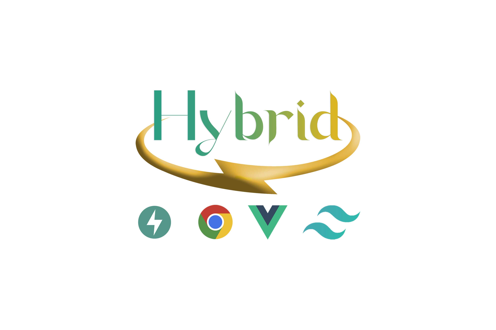
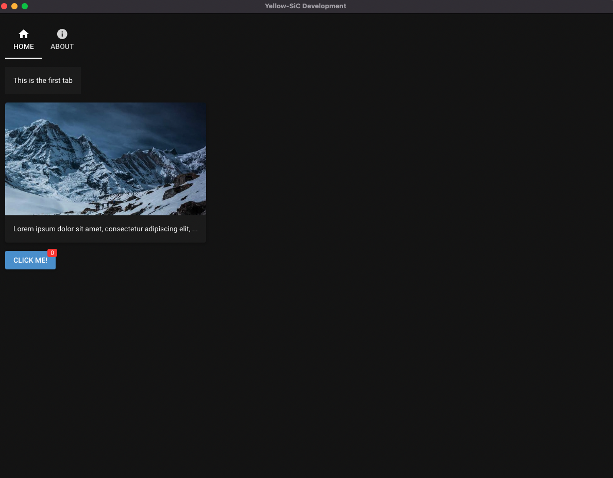

# Hybrid

<p>Hybrid empowers developers to effortlessly build real-time web, mobile, and desktop applications in Python, without requiring prior frontend experience.</p>
<p>It is an incredibly powerful Python library that allows you to create cross-platform graphical user interface applications with ease, similar to Electronjs, but with an integrated Vuejs user interface.</p>
### ⚡From idea to app in minutes
<p>This feature makes Hybrid an ideal choice for creating sophisticated and comprehensive applications, catering to even the most demanding use cases.</p>
### 📐 Simple architecture
<p>At the heart of Hybrid's architecture are cutting-edge technologies such as NiceGUI, FastAPI, Starlette, and Uvicorn, providing an excellent platform for building high-quality applications that seamlessly blend into any environment.</p>
<p>Hybrid also supports the Python ZVT 700 electronic cash register interface, allowing for seamless integration of other transactions into your applications. Additionally, Hybrid supports PWA Progressive Web Applications, enabling easy installation of your app on IOS and Android operating systems.</p>
### 🔋Batteries included
<p>If you're looking for a robust and versatile library to create visually stunning applications, then Hybrid is undoubtedly the right choice. Explore the full potential of this exceptional library by giving it a try today!</p>
[PyPI version](https://badge.fury.io/py/Hybrid.svg)

### 📐 Simple architecture

No more complex architecture with JavaScript frontend, REST API backend, database, cache, etc. With Flet you just write a monolith stateful app in Python only and get multi-user, realtime Single-Page Application (SPA).
## Features

- browser-based graphical user interface
- implicit reload on code change
- standard GUI elements like label, button, checkbox, switch, slider, input, file upload, ...
- simple grouping with rows, columns, cards and dialogs
- general-purpose HTML and Markdown elements
- powerful high-level elements to
  - plot graphs and charts,
  - render 3D scenes,
  - get steering events via virtual joysticks
  - annotate and overlay images
  - interact with tables
  - navigate foldable tree structures
- built-in timer to refresh data in intervals (even every 10 ms)
- straight-forward data binding to write even less code
- notifications, dialogs and menus to provide state of the art user interaction
- shared and individual web pages
- ability to add custom routes and data responses
- capture keyboard input for global shortcuts etc.
- customize look by defining primary, secondary and accent colors
- live-cycle events and session data


## Usage

Write your nice GUI in a file `main.py`:

```python
from hybrid import ui
ui.label('Hello Hybrid!')
ui.button('BUTTON', on_click=lambda: ui.notify('button was pressed'))
ui.run()
```
